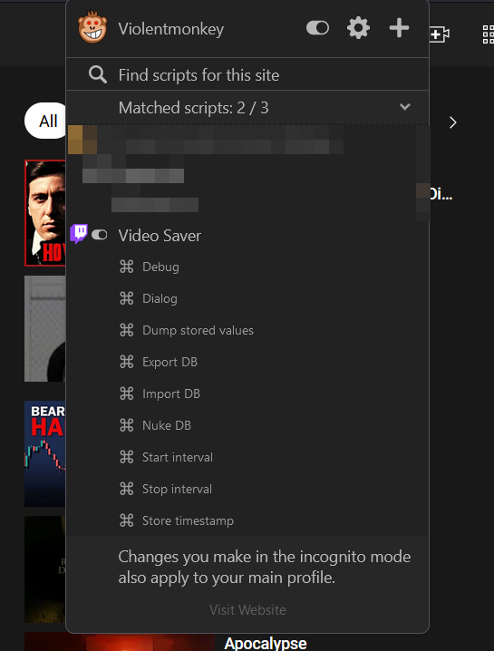
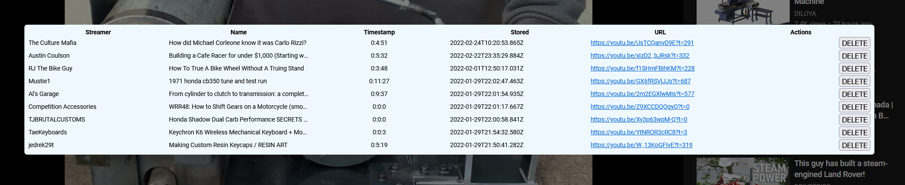

# Video saver

Userscript (tiny browser extension) that stores the timestamps of video portal (Twitch, Youtube) VODs while you are watchin them, automatically or manually, and you can later restore the exact point without logging in to portal or anything else.

## Why?

If one is watching a long video on demand (VOD) on Twitch or YT and does not finish in
a single sitting, or if it's a long series, it is a pain to hunt for the previously
watched point. This script makes it easy by automatically (or manually) storing the timestamps
of all watched VODs and allowing the user to continue from the last point with
a single click.

## How

The script is written and tested with ViolentMonkey, but should work with other
GreaseMonkey derivatives.

Install by clicking "Install from URL" in VM dash and pointing to the raw JS file (dist/build.js), or by copying and pasting the
code into a new file under VM.

Navigate to Youtube or Twitch VOD. Under ViolentMonkey the script should be active and have a list of menu items.

- To store Youtube timestamp manually click `Store timestamp`
- To start Youtube video tracking click `Start interval`
- To stop Youtube video tracking click `Start interval`
- Twitch VODs are tracked automatically
- To later resume the point click `Open dialog` and choose the video URL from the list
- First minute from video is not tracked to avoid storing useless values

<table>
<tr>
<td>

</td>
<td>

</td>
</tr>
</table>